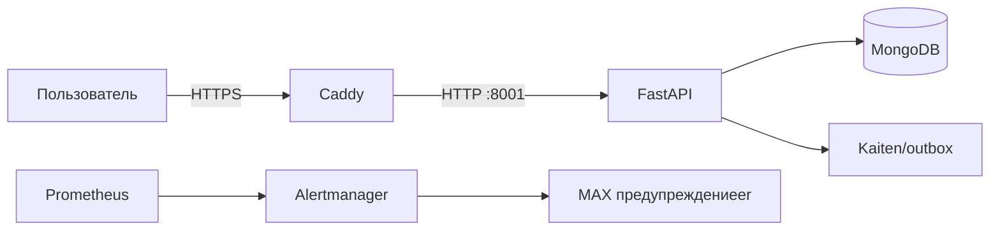

# 1. От услуги к работающей системе

> **Учебная ситуация.** Клиент видит сайт и обещание поддержки, но владелец проекта должен видеть цепочку людей, процессов, кода и данных.

Начните с общей карты и не переходите к production-командам.

## Главное

Система — это компоненты и связи, дающие наблюдаемый результат. Компонент без владельца и способа проверки превращается в скрытый риск.

Состояние — информация, переживающая отдельный запрос: Mongo-документ, volume, MAX-session, договорный границы услуги. Процесс сам по себе не равен состоянию.

Source of truth выбирается по типу факта: Git для кода, Kaiten для работы, Vaultwarden для секретов, договор для обязательств, Prometheus для telemetry.

## Слова, которые встретятся дальше

### точка связи

Согласованная граница обмена между компонентами: адрес/протокол, формат, допустимые ошибки и ожидания по времени. `backend:8001` — сетевой интерфейс; Order Form — организационный интерфейс между продажей и эксплуатацией.

### сохранённые данные

Данные, от которых зависит следующий результат и которые переживают отдельную операцию: документ Mongo, файл session, volume, DNS-запись. Лог процесса не всегда является состоянием.

### общая точка отказа

Набор компонентов, способных отказать вместе из-за общей зависимости. Все containers на одной VM имеют общий общая точка отказа питания, диска и host kernel.

### подтверждение

Минимальный проверяемый артефакт: timestamp, exit code, hash, запрос/ответ, metric или подписанный документ. Скриншот зелёной панели без target и времени — слабое подтверждение.

## Как это работает

Проследите две независимые цепочки. В клиентской цепочке браузер доверяет DNS и TLS, Caddy выбирает route, backend валидирует payload, Mongo сохраняет заявку, а outbox доставляет её наружу. В операционной цепочке exporter публикует metric, Prometheus её забирает, rule создаёт предупреждение, Alertmanager выбирает receiver, а MAX предупреждениеer использует сохранённую session. У этих цепочек разные состояния и разные способы доказательства.

## Пример

### Что здесь происходит

- `flowchart LR` — Стрелка показывает направление зависимости; подпись на стрелке задаёт протокол или тип передачи.
- `U[Пользователь] -->|HTTPS| C[Caddy]` — Стрелка показывает направление зависимости; подпись на стрелке задаёт протокол или тип передачи.
- `C -->|HTTP :8001| B[FastAPI]` — Стрелка показывает направление зависимости; подпись на стрелке задаёт протокол или тип передачи.
- `B --> M[(MongoDB)]` — Стрелка показывает направление зависимости; подпись на стрелке задаёт протокол или тип передачи.
- `B --> K[Kaiten/outbox]` — Стрелка показывает направление зависимости; подпись на стрелке задаёт протокол или тип передачи.
- `P[Prometheus] --> A[Alertmanager]` — Стрелка показывает направление зависимости; подпись на стрелке задаёт протокол или тип передачи.
- `A --> X[MAX предупреждениеer]` — Стрелка показывает направление зависимости; подпись на стрелке задаёт протокол или тип передачи.

## Практикум

1. Перерисуйте схему без подсказки.
2. Для каждой стрелки подпишите протокол и ошибку, которая может на ней возникнуть.
3. Укажите, где хранится состояние и кто его восстанавливает.

## Если что-то не работает

| Наблюдение | Что это означает | Следующая проверка |
|---|---|---|
| Сайт 200, форма не создаёт заявку | проверять frontend→API и outbox. |
| Dashboard зелёный, клиент недоступен | telemetry покрывает не весь пользовательский путь. |

## Проверьте себя

1. Объясните `точка связи` через механизм и приведите пример из этой главы, а не словарную формулировку.
1. Объясните `сохранённые данные` через механизм и приведите пример из этой главы, а не словарную формулировку.
1. Объясните `общая точка отказа` через механизм и приведите пример из этой главы, а не словарную формулировку.
1. Почему симптом «Сайт 200, форма не создаёт заявку» ещё не доказывает единственную причину?
1. Какая независимая проверка отличает выполненную команду от достигнутого результата?

## Источники проекта

- [README.md](https://github.com/i1yxaluk-del/Newbie/blob/89249e43a4e8b2e90d562307ef244ba95288c64c/README.md)
- [docs/NAVIGATION.md](https://github.com/i1yxaluk-del/Newbie/blob/89249e43a4e8b2e90d562307ef244ba95288c64c/docs/NAVIGATION.md)

- [Кураторская видеотека и порядок практики](../VIDEO_GUIDE.md)

