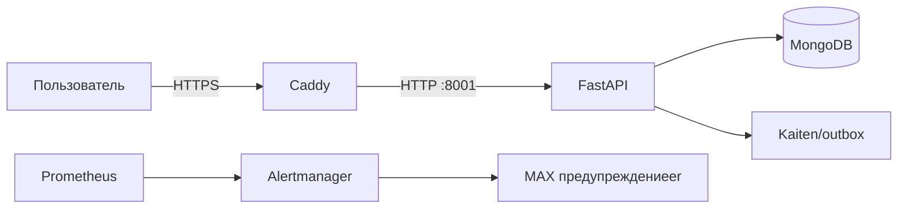

# 1. От услуги к работающей системе

> **Учебная ситуация.** Клиент видит сайт и обещание поддержки, но владелец проекта должен видеть цепочку людей, процессов, кода и данных.

Начните с общей карты и не переходите к production-командам.

## Главное

Система — это компоненты и связи, дающие наблюдаемый результат. Компонент без владельца и способа проверки превращается в скрытый риск.

Состояние — информация, переживающая отдельный запрос: Mongo-документ, volume, MAX-session, договорный границы услуги. Процесс сам по себе не равен состоянию.

Основной источник выбирается по типу факта: Git для кода, Kaiten для работы, Vaultwarden для секретов, договор для обязательств, Prometheus для telemetry.

## Как это работает

Проследите две независимые цепочки. В клиентской цепочке браузер доверяет DNS и TLS, Caddy выбирает route, backend валидирует payload, Mongo сохраняет заявку, а outbox доставляет её наружу. В операционной цепочке exporter публикует metric, Prometheus её забирает, rule создаёт предупреждение, Alertmanager выбирает receiver, а MAX предупреждениеer использует сохранённую session. У этих цепочек разные состояния и разные способы доказательства.

## Пример

## Практикум

1. Перерисуйте схему без подсказки.
2. Для каждой стрелки подпишите протокол и ошибку, которая может на ней возникнуть.
3. Укажите, где хранится состояние и кто его восстанавливает.

## Если что-то не работает

| Наблюдение | Что это означает | Следующая проверка |
|---|---|---|
| Сайт 200, форма не создаёт заявку | проверять frontend→API и outbox. |
| Dashboard зелёный, клиент недоступен | telemetry покрывает не весь пользовательский путь. |

## Источники проекта

- [README.md](https://github.com/i1yxaluk-del/Newbie/blob/89249e43a4e8b2e90d562307ef244ba95288c64c/README.md)
- [docs/NAVIGATION.md](https://github.com/i1yxaluk-del/Newbie/blob/89249e43a4e8b2e90d562307ef244ba95288c64c/docs/NAVIGATION.md)

- [Кураторская видеотека и порядок практики](../VIDEO_GUIDE.md)

