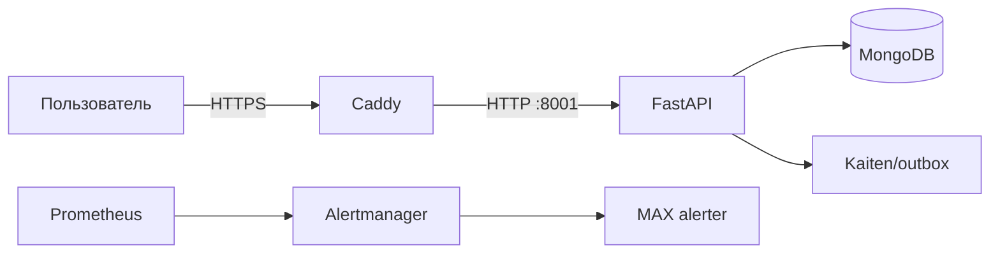

# 1. От услуги к работающей системе

> **Учебная ситуация.** Клиент видит сайт и обещание поддержки, но Owner должен видеть цепочку людей, процессов, кода и данных.

Начните с общей карты и не переходите к production-командам.

## Модель, которую нужно построить

Система — это компоненты и связи, дающие наблюдаемый результат. Компонент без владельца и способа проверки превращается в скрытый риск.

Состояние — информация, переживающая отдельный запрос: Mongo-документ, volume, MAX-session, договорный scope. Процесс сам по себе не равен состоянию.

Source of truth выбирается по типу факта: Git для кода, Kaiten для работы, Vaultwarden для секретов, договор для обязательств, Prometheus для telemetry.

## Термины в рабочем смысле

### interface

Согласованная граница обмена между компонентами: адрес/протокол, формат, допустимые ошибки и ожидания по времени. `backend:8001` — сетевой интерфейс; Order Form — организационный интерфейс между продажей и эксплуатацией.

### state

Данные, от которых зависит следующий результат и которые переживают отдельную операцию: документ Mongo, файл session, volume, DNS-запись. Лог процесса не всегда является состоянием.

### failure domain

Набор компонентов, способных отказать вместе из-за общей зависимости. Все containers на одной VM имеют общий failure domain питания, диска и host kernel.

### evidence

Минимальный проверяемый артефакт: timestamp, exit code, hash, запрос/ответ, metric или подписанный документ. Скриншот зелёной панели без target и времени — слабое evidence.

## Что происходит внутри

Проследите две независимые цепочки. В клиентской цепочке браузер доверяет DNS и TLS, Caddy выбирает route, backend валидирует payload, Mongo сохраняет заявку, а outbox доставляет её наружу. В операционной цепочке exporter публикует metric, Prometheus её забирает, rule создаёт alert, Alertmanager выбирает receiver, а MAX alerter использует сохранённую session. У этих цепочек разные состояния и разные способы доказательства.

## Разобранный пример

### Как читать пример

- `flowchart LR` — None
- `U[Пользователь] -->|HTTPS| C[Caddy]` — None
- `C -->|HTTP :8001| B[FastAPI]` — None
- `B --> M[(MongoDB)]` — None
- `B --> K[Kaiten/outbox]` — None
- `P[Prometheus] --> A[Alertmanager]` — None
- `A --> X[MAX alerter]` — None

## Практикум

1. Перерисуйте схему без подсказки.
2. Для каждой стрелки подпишите протокол и ошибку, которая может на ней возникнуть.
3. Укажите, где хранится состояние и кто его восстанавливает.

## Если результат не совпал с ожиданием

| Наблюдение | Что это означает | Следующая проверка |
|---|---|---|
| Сайт 200, форма не создаёт заявку | Это сужает область поиска, но не доказывает единственную причину | проверять frontend→API и outbox. |
| Dashboard зелёный, клиент недоступен | Это сужает область поиска, но не доказывает единственную причину | telemetry покрывает не весь пользовательский путь. |

## Самостоятельная работа

Решите изменённый вариант исходной ситуации: **Клиент видит сайт и обещание поддержки, но Owner должен видеть цепочку людей, процессов, кода и данных.** Измените один существенный параметр — host, port, credential, dataset, пакет или ограничение клиента — и сначала письменно предскажите результат. Затем выполните проверку на безопасном стенде. В отчёте оставьте исходное предположение, фактическое наблюдение, причину расхождения и способ восстановления.

## Проверка понимания

1. Объясните `interface` через механизм и приведите пример из этой главы, а не словарную формулировку.
1. Объясните `state` через механизм и приведите пример из этой главы, а не словарную формулировку.
1. Объясните `failure domain` через механизм и приведите пример из этой главы, а не словарную формулировку.
1. Почему симптом «Сайт 200, форма не создаёт заявку» ещё не доказывает единственную причину?
1. Какая независимая проверка отличает выполненную команду от достигнутого результата?

## Источники проекта

- [README.md](https://github.com/i1yxaluk-del/Newbie/blob/89249e43a4e8b2e90d562307ef244ba95288c64c/README.md)
- [docs/NAVIGATION.md](https://github.com/i1yxaluk-del/Newbie/blob/89249e43a4e8b2e90d562307ef244ba95288c64c/docs/NAVIGATION.md)

- [Русскоязычный видеопоиск: От услуги к работающей системе](https://www.youtube.com/results?search_query=%D0%9E%D1%82+%D1%83%D1%81%D0%BB%D1%83%D0%B3%D0%B8+%D0%BA+%D1%80%D0%B0%D0%B1%D0%BE%D1%82%D0%B0%D1%8E%D1%89%D0%B5%D0%B9+%D1%81%D0%B8%D1%81%D1%82%D0%B5%D0%BC%D0%B5+%D0%BD%D0%B0+%D1%80%D1%83%D1%81%D1%81%D0%BA%D0%BE%D0%BC)

## Условие перехода

Глава завершена, если вы можете связно объяснить `interface`, `state`, `failure domain`, выполнить практикум без копирования команд и восстановить систему после описанного отказа. Запишите в `learning-log.md`, что осталось непонятным; неизвестность не заменяйте догадкой.
