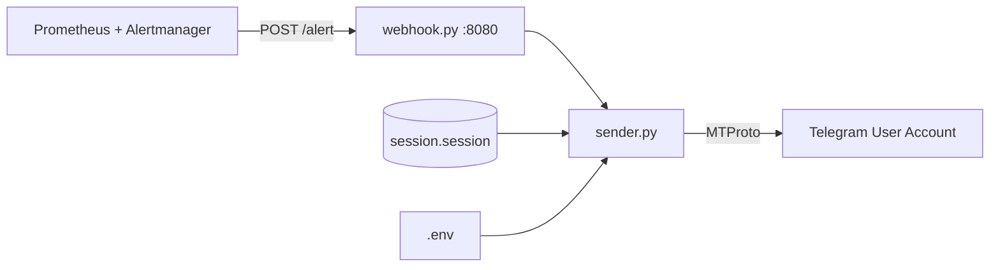

# Настройка MAX Alerter (pymax-based userbot)

## 1. Что такое pymax и зачем он нужен

**pymax** — это неофициальная библиотека для работы с Telegram через MTProto (протокол, используемый самим Telegram). В отличие от официального Bot API:

| Официальный Bot API | pymax (MTProto) |
|---|---|
| Требует регистрации бота через @BotFather | Работает с любым аккаунтом Telegram |
| IP-адрес сервера должен быть разрешён в Telegram | Нет привязки к IP |
| Webhook требует HTTPS и публичного домена | Не требует webhooks — работает через сохранённую сессию |
| Ограничения по количеству сообщений | Значительно более гибкие лимиты |

**Ключевое преимущество**: pymax сохраняет сессию авторизации в `session.session` файл. После первичной авторизации на хосте (один раз), сессия монтируется как volume в Docker, и контейнер работает без необходимости повторной авторизации.

## 2. Архитектура

```
auth.py              →  sender.py            →  webhook.py         →  Docker
(авторизация)          (отправка сообщений)     (HTTP-сервер)         (контейнеризация)
```

- **auth.py** — интерактивная авторизация на хосте (запрос номера телефона и кода)
- **sender.py** — модуль отправки сообщений через сохранённую сессию
- **webhook.py** — FastAPI/Flask сервер, принимающий Alertmanager webhook
- **Docker** — сборка и запуск всего в контейнере с volume для session

### Схема работы



## 3. Настройка

### Шаг 1: Получение API ID и API Hash

1. Перейдите на https://my.telegram.org/apps
2. Войдите в свой Telegram аккаунт
3. Создайте приложение, если его нет
4. Скопируйте `api_id` и `api_hash`

### Шаг 2: Авторизация на хосте

```bash
# Клонируем репозиторий
git clone https://github.com/ваш-username/ваш-репозиторий.git
cd ваш-репозиторий

# Устанавливаем зависимости
pip install -r services/max_alerter/requirements.txt

# Запускаем авторизацию
cd services/max_alerter
python auth.py
```

В процессе авторизации:
- Введите номер телефона в международном формате (`+79001234567`)
- Введите код подтверждения, присланный в Telegram
- (Опционально) Введите пароль 2FA, если он включён

После успешной авторизации будет создан файл `session.session`. Этот файл — ключ к вашему аккаунту, храните его в безопасности!

### Шаг 3: Настройка .env

Создайте файл `.env` рядом с `docker-compose.yml`:

```env
API_ID=1234567
API_HASH=ваш_api_hash
SESSION_STRING= # оставить пустым — будет загружена из session.session
CHAT_ID=@username_канала_или_чата
TEMPLATE_FILE=/app/templates/alert_template.md
```

- `API_ID` и `API_HASH` — из личного кабинета my.telegram.org
- `CHAT_ID` — ID чата или @username канала, куда будут приходить алерты
- `TEMPLATE_FILE` — путь к шаблону форматирования сообщений

### Шаг 4: Запуск в Docker

```yaml
# docker-compose.yml
version: '3.8'

services:
  max-alerter:
    build: ./services/max_alerter
    container_name: max-alerter
    restart: unless-stopped
    ports:
      - "8080:8080"
    volumes:
      - ./services/max_alerter/session.session:/app/session.session
      - ./services/max_alerter/.env:/app/.env
      - ./services/max_alerter/templates:/app/templates
    environment:
      - TZ=Europe/Moscow
```

```bash
docker-compose up -d --build
```

### Шаг 5: Проверка

```bash
# Проверяем логи
docker logs -f max-alerter

# Отправляем тестовый алерт
curl -X POST http://localhost:8080/alert \
  -H "Content-Type: application/json" \
  -d '{
    "status": "firing",
    "alerts": [{
      "labels": {"alertname": "TestAlert", "severity": "critical"},
      "annotations": {"summary": "Тестовое сообщение", "description": "Проверка работы pymax"},
      "startsAt": "2024-01-01T00:00:00Z"
    }]
  }'
```

## 4. Интеграция с Alertmanager

### Конфигурация Alertmanager

```yaml
# alertmanager.yml
route:
  receiver: 'telegram-max'

receivers:
- name: 'telegram-max'
  webhook_configs:
  - url: 'http://ваш-сервер:8080/alert'
    send_resolved: true
```

### Формат сообщений

Шаблон сообщений (по умолчанию `templates/alert_template.md`):

```jinja2
🔥 **FIRING**✅ **RESOLVED**

**Alert**: {{ (index .Alerts 0).Labels.alertname }}
**Severity**: {{ (index .Alerts 0).Labels.severity }}

**Description**:
{{ (index .Alerts 0).Annotations.description }}

**Summary**: {{ (index .Alerts 0).Annotations.summary }}
**Started**: {{ (index .Alerts 0).StartsAt }}
```

## 5. Telegram Fallback

Если основной аккаунт недоступен (например, сессия истекла или аккаунт заблокирован), система автоматически переключается на резервный механизм:

1. **Первичный канал** — основной аккаунт через pymax (MTProto)
2. **Fallback** — официальный Bot API (требуется настроить BOT_TOKEN)

Для настройки fallback добавьте в `.env`:

```env
BOT_TOKEN=123456:ABC-DEF1234ghIkl-zyx57W2v1u123ew11
FALLBACK_ENABLED=true
```

Если `FALLBACK_ENABLED=true` и `BOT_TOKEN` задан, при ошибке отправки через pymax, сообщение будет отправлено через Bot API.

## 6. Заметки по безопасности

1. **session.session** — это полный доступ к вашему Telegram аккаунту.
   - 🔒 Никогда не добавляйте его в Git (добавлен в `.gitignore`)
   - 🔒 Используйте `.env` для чувствительных данных
   - 🔒 Регулярно обновляйте `api_id`/`api_hash`, если подозреваете компрометацию

2. **Ограничьте доступ к порту 8080**:
   ```bash
   # Разрешить только Alertmanager
   sudo ufw allow from 10.0.0.0/8 to any port 8080
   ```

3. **Используйте reverse proxy** (рекомендуется для production):
   ```nginx
   # nginx.conf
   server {
       listen 443 ssl;
       server_name alerts.example.com;

       location /alert {
           proxy_pass http://127.0.0.1:8080;
           proxy_set_header Host $host;
           proxy_set_header X-Real-IP $remote_addr;
       }
   }
   ```

4. **Мониторинг сессии**: файл `session.session` может "протухнуть" при длительном бездействии. Рекомендуется:
   - Периодически отправлять тестовые сообщения (healthcheck)
   - Включить автоматическое переподключение при ошибке сессии

## 7. Troubleshooting

### Проблема: "Could not connect to Telegram"

```bash
# Проверьте интернет-соединение
ping api.telegram.org

# Проверьте, что MTProto порты не заблокированы
# (443 TCP должен быть открыт)
telnet api.telegram.org 443
```

### Проблема: "Session expired"

Удалите `session.session` и запустите `auth.py` заново:

```bash
rm services/max_alerter/session.session
cd services/max_alerter && python auth.py
```

### Проблема: "Flood wait" (ограничение частоты)

pymax автоматически обрабатывает flood wait, но если сообщения не доходят:

```bash
# Проверьте логи
docker logs max-alerter --tail 50

# Увеличьте интервал между сообщениями в .env
SEND_DELAY=5  # секунд между сообщениями
```

### Проблема: Docker не видит session.session

```bash
# Проверьте права на файл
ls -la services/max_alerter/session.session

# Исправьте права
chmod 644 services/max_alerter/session.session
```

### Проблема: Webhook не принимает алерты

```bash
# Проверьте, что сервер запущен
curl http://localhost:8080/health

# Если нет ответа — проверьте конфигурацию порта
docker ps | grep max-alerter
```

## 8. Структура проекта

```
services/max_alerter/
├── auth.py              # Интерактивная авторизация
├── sender.py            # Отправка сообщений через pymax
├── webhook.py           # HTTP-сервер для Alertmanager
├── requirements.txt     # Зависимости
├── templates/
│   └── alert_template.md  # Шаблон сообщения
├── session.session      # Сессия (создаётся при авторизации)
├── .env                 # Конфигурация
└── Dockerfile           # Сборка образа
```

## 9. Полезные ссылки

- [Документация Telethon (основа pymax)](https://docs.telethon.dev/)
- [Настройка Alertmanager](https://prometheus.io/docs/alerting/latest/alertmanager/)
- [Telegram API ID](https://my.telegram.org/apps)